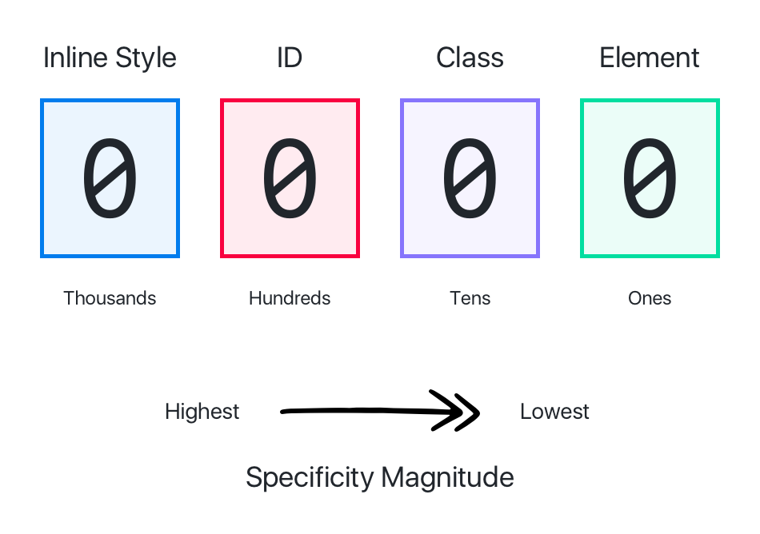

# Cascading Style Sheets
My works related to Cascading Style Sheets (CSS)

## Table of Contents
1. [Introduction.](#introduction)
2. [CSS Specificity.](#specificity)
3. [Official references websites.](#references)
4. [GitHub notes.](#github)

<a name="introduction"></a>
## Introduction


Cascading Style Sheets (CSS) is a style sheet language used for describing the presentation of a document written in a markup language like HTML CSS is a cornerstone technology of the World Wide Web, alongside HTML and JavaScript

CSS is designed to enable the separation of presentation and content, including layout, colors, and fonts. This separation can improve content accessibility, provide more flexibility and control in the specification of presentation characteristics, enable multiple web pages to share formatting by specifying the relevant CSS in a separate .css file, and reduce complexity and repetition in the structural content.

Separation of formatting and content also makes it feasible to present the same markup page in different styles for different rendering methods, such as on-screen, in print, by voice (via speech-based browser or screen reader), and on Braille-based tactile devices. CSS also has rules for alternate formatting if the content is accessed on a mobile device.

The name cascading comes from the specified priority scheme to determine which style rule applies if more than one rule matches a particular element. This cascading priority scheme is predictable. The CSS specifications are maintained by the World Wide Web Consortium (W3C). Internet media type (MIME type) text/css is registered for use with CSS by RFC 2318 (March 1998). The W3C operates a free CSS validation service for CSS documents.

In addition to HTML, other markup languages support the use of CSS including XHTML, plain XML, SVG, and XUL.

<a name="specificity"></a>
## CSS Specificity
CSS applies different weights to different selectors. Each weight is a magnitude higher than the other.

To calculate the specificity value (which selector will be applied), we simply look at the selector and add a value of 100 for every id selector, add 10 for every class selector and add 1 for every element selector.



As you can see, each type of selector is weighted a magnitude higher than the previous one. 

<a name="references"></a>
## Official references websites
Cascading Style Sheets documentation by Mozilla : https://developer.mozilla.org/en-US/docs/Web/CSS/Reference <br />
CSS Almanac : https://css-tricks.com/almanac <br />
CSS Colors : https://www.w3schools.com/cssref/css_colors.asp <br />
CSS online playground : https://codepen.io <br />
CSS Color Picker by WebFX : https://www.webfx.com/web-design/color-picker <br />
CSS patterns by toptal : https://www.toptal.com/designers/subtlepatterns <br />
CSS Specificity Calculator : https://specificity.keegan.st <br />
CSS Box Model by CSS-Tricks : https://css-tricks.com/the-css-box-model <br />
CSS Box Model by w3.org : https://www.w3.org/TR/CSS2/box.html <br />
CSS Reset by Eric A. Meyer : https://meyerweb.com/eric/tools/css/reset/ <br />
CSS Visual Format Model : https://www.w3.org/TR/CSS2/visuren.html <br />
CSS micro clearfix by Nicolas Gallagher : http://nicolasgallagher.com/micro-clearfix-hack <br />

CSS3 properties by Quackit : https://www.quackit.com/css/css3/properties <br />
CSS3 browser support list : https://caniuse.com <br />
CSS3 prefixes playground : http://pleeease.io/play <br />
CSS3 Filter Effect : shttp://html5-demos.appspot.com/static/css/filters/index.html <br />

Open source pictures : https://unsplash.com <br />
Open source patterns by toptal : https://www.toptal.com/designers/subtlepatterns <br />
Open source GNU Image Manipulation (GIMP) : https://www.gimp.org <br />
Open source Krita : https://krita.org <br />
Open source online Free Photo Tool : https://www.freephototool.com <br />
Online Photopea : https://www.photopea.com <br />
Online Google Fonts : https://fonts.google.com <br />
Online fonts library by Font Squirrel : https://www.fontsquirrel.com/

<a name="github"></a>
## GitHub notes
Initialize repository, adding GitHub remote repository and check the remote repository.
```
$ git init
$ git remote add origin https://github.com/syakirharis25/CSS.git
$ git remote -v
$ git status
```

If there is an error message.
```
! [rejected]        master -> master (non-fast-forward)
error: failed to push some refs to 'https:///github.com/syakirharis25/css.git'
```

Then do this command.
```
$ git merge origin/master --allow-unrelated-histories
$ git push origin master
```

If the files on the local machine and remote still not merge then do this command.
```
$ git clone https://github.com/syakirharis25/CSS
```
